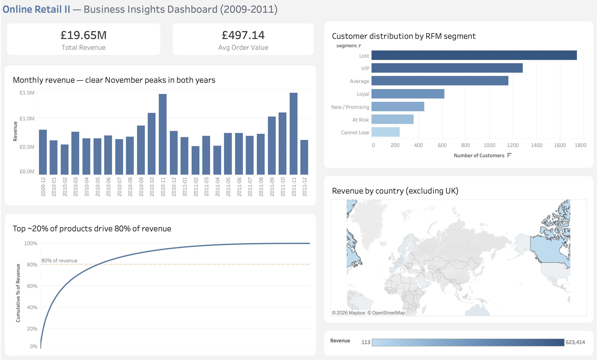

# Online Retail II — Business Insights Analysis

**An end-to-end data analysis of 1M+ transactions from a UK-based online retailer, demonstrating data cleaning, SQL analysis, and interactive visualization.**

**[Interactive Tableau Dashboard](https://public.tableau.com/app/profile/edison.khuong/viz/OnlineRetailIIBusinessInsightsDashboard/OnlineRetailIIBusinessInsightsDashboard)**

---

## Project Overview

This project takes the [UCI Online Retail II dataset](https://archive.ics.uci.edu/dataset/502/online+retail+ii) — a real-world, famously messy dataset of e-commerce transactions from December 2009 to December 2011 — and walks it through a complete analytics pipeline: extraction, cleaning, transformation, SQL-based analysis, and interactive visualization.

The work answers five business questions a retail analyst would actually ask:

1. **Revenue trends** — How does revenue evolve over time? Is there seasonality?
2. **Customer segmentation** — Who are the VIPs? Who's at risk of churning?
3. **Product performance** — Which products drive revenue? Is there a Pareto pattern?
4. **Geographic reach** — Which markets matter, and which are untapped?
5. **Cancellation behavior** — What gets returned, and when?

## Key Findings

- **Strong November seasonality.** November drives roughly 2x a typical month in both years — the retailer's business is heavily concentrated around the Christmas gift-buying window.
- **Classic Pareto distribution in products.** Roughly the top 20% of SKUs account for 80% of revenue, with clear implications for inventory prioritization.
- **RFM segmentation reveals a churn problem.** The "Lost" segment (customers who haven't purchased recently) is the largest by count, pointing toward a retention opportunity rather than a customer-acquisition gap.
- **UK dominates (~85% of revenue)** but several European markets — notably the Netherlands, EIRE, and Germany — show meaningfully high order values, suggesting wholesale or bulk-buyer opportunities.
- **Peak shopping window is Tuesday–Thursday, 10am–3pm.** Saturday activity is negligible (likely operational closure), a finding with direct implications for email send timing and promotional campaigns.

## Stack

- **Python (pandas, numpy)** — data cleaning and feature engineering
- **SQLite + SQL** — structured storage and analytical queries (CTEs, window functions, joins)
- **Jupyter Lab** — exploration, cleaning, and analysis notebooks
- **Tableau Public** — interactive dashboard hosted online
- **matplotlib** — supplementary in-notebook charting

## Data Cleaning — Decisions Made

The raw dataset required several judgment calls, each documented in `02_clean.ipynb`:

| Decision | Rationale |
|---|---|
| Remove 'A'-prefix invoices (6 rows) | Identified as accounting adjustments (bad-debt write-offs), not customer transactions |
| Separate 'C'-prefix invoices (~22K rows) into their own table | Cancellations are real events worth analyzing, but distort sales-side metrics if mixed in |
| Remove non-product stock codes (POST, DOT, M, BANK CHARGES, AMAZONFEE, etc.) | Allowlist approach initially tried with regex; switched to explicit exclusion list after discovering legitimate products with 2-3 letter variant codes (e.g., `15056BL`) and non-standard code prefixes (`DCGS*`) were being incorrectly filtered out |
| Drop 4,369 rows with null Description | Inspection revealed these are inventory adjustments (all zero-price, null customer, extreme quantities) — not customer transactions |
| Drop rows with Price ≤ 0 or Quantity ≤ 0 (after cancellation split) | Data entry errors after cancellations are already isolated |
| Remove exact duplicates | Same invoice + product + quantity + price + timestamp indicates double-insertion, not a second purchase |
| **Keep** rows with missing Customer ID (~25% of data) but flag them | Valid sales for revenue/product analysis; filtered out only when customer segmentation requires known IDs |

**Final dataset:** 1,003,425 clean sales rows across 5,852 known customers, 4,904 unique products, and 43 countries.

## Reproducing This Analysis

1. Download the dataset from the [UCI Machine Learning Repository](https://archive.ics.uci.edu/dataset/502/online+retail+ii) (free, no login)
2. Place `online_retail_II.xlsx` in `data/`
3. Run notebooks in order: `01_explore.ipynb` → `02_clean.ipynb` → `03_sql_analysis.ipynb`
4. The cleaning notebook produces `sales_clean.csv` and `cancellations.csv`
5. The SQL notebook loads them into `retail.db` (SQLite) and exports summary tables to `data/tableau_exports/`

Required Python packages: `pandas`, `numpy`, `matplotlib`, `openpyxl`, `sqlalchemy`.

## About the Dataset

The UCI Online Retail II dataset represents transactions from a non-store online retailer based in the UK, primarily selling unique all-occasion giftware. Data covers December 2009 to December 2011. The dataset is widely used in academic and industry data analysis case studies.

---

*This project is a portfolio piece demonstrating end-to-end data analytics skills — from raw data ingestion through interactive dashboarding. Open to feedback or questions.*
└── README.md
